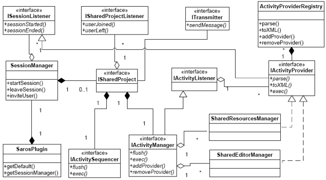
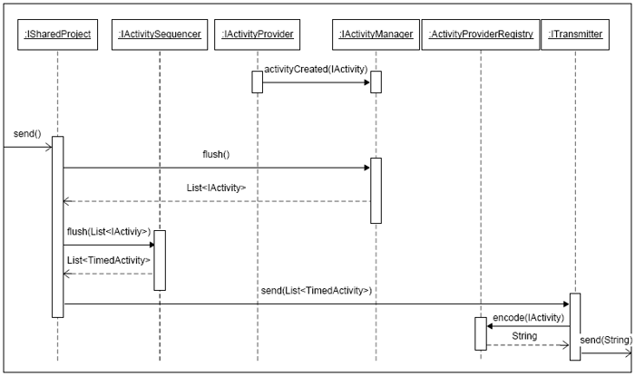
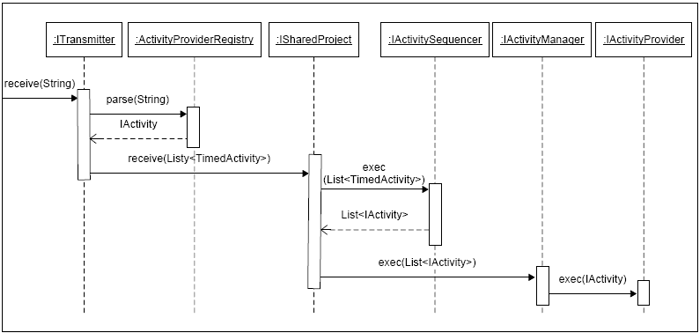
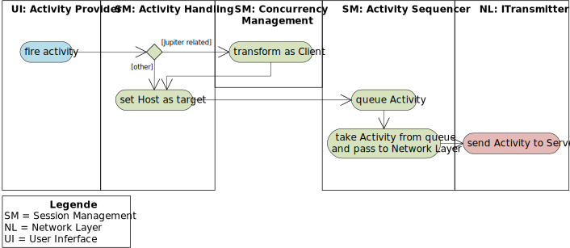
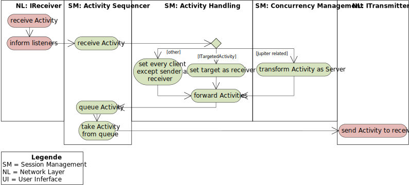
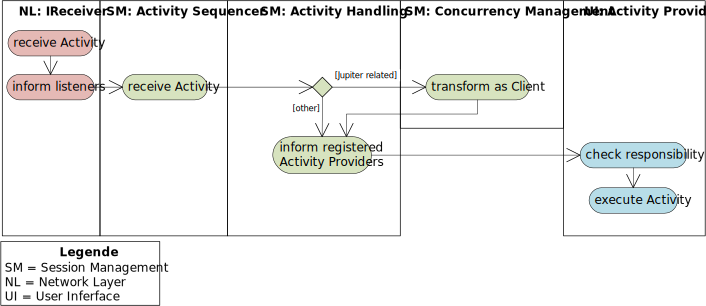

# {{ page.title }}
{:.no_toc}



## Overview

Activities are events that **capture an action performed by a
participant** that **changes the state of the session**.

They are **value objects** and should thus be immutable.

Handling activities is performed on the **Inversion of Control
pattern**.

All activities should inherit from `IActivity`, thus ensuring that they
are "automatically" directed to the proper activity **receivers that
execute them**.

An activity provider is **responsible for creating and executing** one
or more activity types.

Activity providers **execute their activities locally**.

Providers report when they **create an activity to the registered
listeners** by calling `IActivityListener.activityCreated(IActivity)`.

The provider is intended to use
`ISarosSession#addActivityProvider(IActivityProvider)`, which in turn
**will register** the `ISarosSession `to the provider. This way, the
provider can **fire activities for a Saros session** by calling
`activityCreated()`.

## How Saros handles activities

*Warning: this documentation is partially out of date*

The core functionality of Saros is to **intercept several relevant
actions in Eclipse** (like inserting text, selecting text, opening
files) and **reproducing these actions** at other clients of the DPP
session.

Especially **modifications are important** to reproduce.

At the beginning of the session **every member gets the current
version** of the project.

During the session **every modification of a resource** has to be
**performed on all other clients**, to keep up the **synchronal state**
of the project at all clients.

The following figure shows the main interfaces and classes of Saros
handling activities.

Activities are created when listeners **catch a relevant action in
Eclipse**.

Like a keypress in a project file editor is caught by a
`IDocumentListener `that was registered at the Eclipse framework.

Activities will be **wrapped in an object**, **get a timestamp**, **put
in a queue** and **transmitted as XMPP message** (XML format) to other
clients of a DPP session.

On their end the activity object **will be recreated by examining the
XML body** of the received message, creating an **activity object**,
**put it in a timestamp ordered list** and **sequentially executed** on
the clients Eclipse environment.

Creating and sending an activity

Receiving and repeating an activity

Activities are the most important way of communication to keep a *Shared
Session* consistent.

## Client Sending

The following Diagram shows how Activities are sent by clients in Saros.
Notice that the Host also acts as a Client for locally created
Activities.

New Activities are created by the *Activity Providers*. They take
actions of the local user and transform them to Activities. As *Activity
Providers* are registered at the *Session Management* the *Activity
Handling* gets informed about the new Activity and sets the Host as
target for this Activity. If the Activity is Jupiter related it will
first be passed to the *Concurrency Management* where it will be
transformed.

Afterward the Activity will be passed to the *Activity Sequencer* where
it will be queued and also gets a timestamp to ensure a global ordering
of Activities. The *OutgoingActivityQueue* is polled frequently and the
Activities will then be passed to the *ITransmitter* where they are
transformed into XMPP-messages and transmitted to the Host.

## Activity Server

All Clients send their Activities to the Server located at the Host. The
following diagram shows how the Server handles and directs incoming
Activities.

Every participant receives Activities via the *IReceiver*. The
*IReceiver* allows other components to register *packetListeners* that
will be informed when Messages with a specific *PackageExtension*
arrive. The *Activity Sequencer* also registers such a listener and will
be informed when new Activities arrive. The *Activity Sequencer* checks
that the Activity has the right sequence-number and if so passes it to
the *Activity Handling*.

The *Activity Handling* distinguishes between three different types of
Activities:

1.  *Jupiter related Activity*: Activities that are related to the
    *Jupiter*-Algorithm will be passed to the *Concurrency Management*
    where they will be transformed into an Activity with a different
    timestamps for each participant. Every participants gets a separate
    Activity and is set as its receiver.
2.  *ITargetedActivity*: When processing an *ITargetedActivity* the
    receiver will be set as the target of the Activity.
3.  *Others:* The receivers of all other Activities are all participants
    except the creator of the Activity.

After setting the right receivers the Activities will again be send to
the *ITransmitter*, via the *Activity Sequencer*, and transmitted to the
intended receivers.

## Client Receiving

After the Server has distributed the Activities all intended Clients
receive them. Again, remember that the Host also acts as a Client
despite housing the Server. The following diagram shows how the
receiving works.

When a new Activity arrives the *Activity Sequencer* will be informed
about this and passes the Activity to the *Activity Handling*.

The *Activity Handling* passes incoming Activities to the *Concurrency
Control* if needed. For example a *JupiterActivity* will be transformed
back into a *TextEditActivity*. Afterwards the *Activitiy Handling*
informs all registered *Activity Providers* about the new Activity.
Every *Activity Provider* checks himself if he is responsible for this
type of Activity. If responsible the *Activity Provider* transforms the
Activity back into an action, that can be applied to the local
Saros-Instance and executes this action.