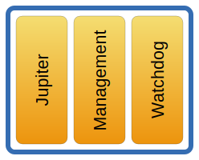

# {{ page.title }}
{:.no_toc}



To support a writing collaboration of multiple users, Saros uses the
**Jupiter algorithm for concurrency control**. The Concurrency Control
keeps all shared data of the participants of a Saros session consistent.

## Overview

## Jupiter

The functionality of the Jupiter package is based on the Jupiter
algorithm taken from the Open Source project
[ACE](http://sourceforge.net/projects/ace/)(A
Collaborative Editor).

The `Jupiter `class implements the **client-side core** of the Jupiter
control algorithm.

It generates `JupiterActivities `**for local operations** and transforms
received `JupiterActivities `into operations **that need to be executed
locally**. **Operations are changes** made on a document.

An operation contains **what has changed** and the position **where it
was changed**.

These changes made by multiple participants of a Saros session need to
be **executed in the correct order** and position by all participants so
that they all have the **same consistent copy** of this changed
workspace.

Both participants of a Saros session C and S start with the text "abc". C performs an **insert operation** `insert(0,"def")` and S performs an **delete operation** `delete(1,"b")`. The resulting text is "defac". Since the local operation **is performed immediately** at each participants side, the received operation of the other participant **is transformed to ensure the consistency**. Therefore for participant C the delete operation is transformed into `delete(4,"b")`. For participant S the transformation doesn't change the insert operation.

## Examples

### Management

The subpackage `management `is responsible for **managing the state of
the shared workspace** in a Saros session.

Every user with **write-access** sends their `JupiterActivities `to the
`ConcurrentDocumentServer `located on the host side where they are
**transformed and sent to everybody else**.

The transformed `JupiterActivities `are **received and transformed** to
`TextEditActivities `in the `ConcurrentDocumentClient `for execution on
the **client side**.

The **host** of the session is always responsible for **managing the
state of all projects** (or **files**), even when a client adds projects
or files to the Saros session.

### Watchdog

The consistency `Watchdog `is responsible for **monitoring the states**
of all participant's workspaces and to **recover from inconsistent
states** between the participants of a Saros session.

**For all opened files** anywhere in the shared session (host and
clients) **checksums are generated periodically** (every 10 seconds) on
the host side. The basis for these checksums are the current contents of
the editors, *not* the content of the files as they are written on the
harddrive.

These **checksums are sent to all clients** and the clients check their
**locally generated checksums against them**.

If an **inconsistency is detected** the **inconsistency state is set**
and the user of the session gets informed (the yellow triangle on the
Saros View).

When the user wants to **recover from that inconsistency** a
`ChecksumError `is **sent to the host** and **waited** for the reply.

The user receives the **file changes from the host**.

The host can **never be in an inconsistent state**.
