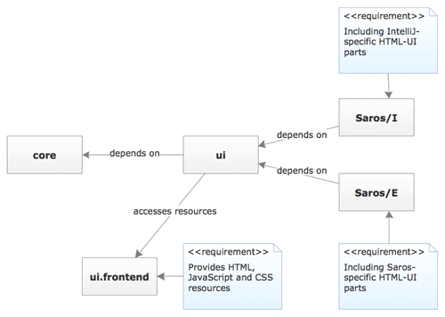
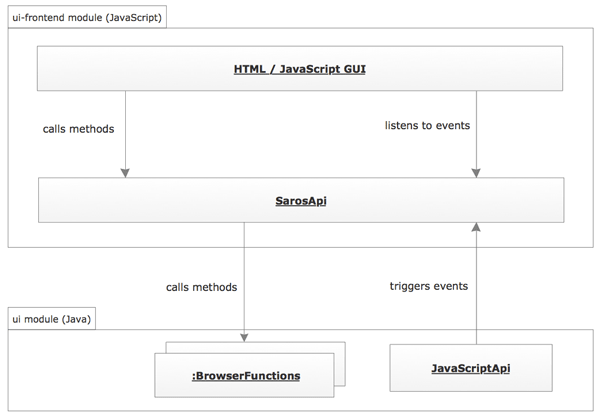

# {{ page.title }}
{:.no_toc}



Since we're working on [Saros for IntelliJ](../../documentation/saros-for-intellij.md),
the question arose how to handle the two different GUI frameworks of
Eclipse (which uses SWT) and IntelliJ (which uses Swing). Our answer is
to embed a web browser in the IDE which can display HTML elements that
are styled via CSS and made interactive through JavaScript.

This page explains the basic things you need to know if you want to
further the development of the Saros HTML GUI.

## Activating the HTML GUI

The usage of the HTML version of Saros is guarded by a feature toggle.

### Eclipse

In Eclipse you have to uncomment the `SarosViewBrowserVersion` view in
[`de.fu_berlin.inf.dpp/plugin.xml`](https://github.com/saros-project/saros/blob/master/de.fu_berlin.inf.dpp/plugin.xml#L21)
and provide the Java property

    saros.swtbrowser=true

by changing the corresponding line in
[`de.fu_berlin.inf.dpp/saros.properties`](https://github.com/saros-project/saros/blob/master/de.fu_berlin.inf.dpp/saros.properties#L41).

To be able to see the HTML GUI in eclipse when running Saros, you have
to open the Saros view in eclipse via Window &gt; Show View &gt; Other
&gt; Saros &gt; Saros View.

### IntelliJ

In IntelliJ you just have to provide

    -Dsaros.swtbrowser=true

as VM Option (in the Run Configurations dialog). For further information
about developing the HTML GUI in IntelliJ please see
[here](https://www.saros-project.org/setup-intellij-environment).

## Installing dependencies

To develop the Saros GUI JavaScript application, the
[NodeJS](http://nodejs.org) package manager,
[NPM](https://www.npmjs.com/) is required. NPM is responsible for
providing external JavaScript resources and tools for tasks like running
unit tests and building the application. For more information about
installing NodeJS and NPM see [here](http://nodejs.org).

You may try the most recent LTE version of NodeJS (i.e. from the 4.2.\*
line), but there are [occassional problems with newer NodeJS version
under Windows
8+](http://article.gmane.org/gmane.comp.ide.eclipse.saros.devel/1694).
If you encounter such problems, the newest fall-back version is [NodeJS
0.10.41](https://nodejs.org/download/release/v0.10.41/).

Before you are able to run the build tasks you have to navigate to
`de.fu_berlin.inf.dpp.ui.frontend.md/` and run `npm install` to
download and install external dependencies.

Required dependencies and tools as well as convenient script definitions
are defined in
[`de.fu_berlin.inf.dpp.ui.frontend.md/package.json`](https://github.com/saros-project/saros/blob/master/de.fu_berlin.inf.dpp.ui.frontend.md/package.json),
see [here](https://docs.npmjs.com/files/package.json) for a detailed
documentation.

## Building the JavaScript application

Currently, the building of the JavaScript application is NOT integrated
in the general Saros build process and must therefore be executed
separately. To build the JavaScript application, navigate to
`de.fu_berlin.inf.dpp.ui.frontend.md/` and run `npm run build`.
Alternatively it is also possible to run `npm run watch`, which builds
the application once and then listens to any future changes and
automatically rebuilds everytime (read [here](168.md#watch-script) for
more information).

## Getting to know the code of the HTML GUI

The code consists of four parts

-   the Java part which defines the interface between the core module
    and the GUI, which is located in the
    [`de.fu_berlin.inf.dpp.ui`](https://github.com/saros-project/saros/tree/master/de.fu_berlin.inf.dpp.ui)
    module,
-   the actual GUI code (HTML, CSS and JavaScript resources), which is
    located in the
    [`de.fu_berlin.inf.dpp.ui.frontend`](https://github.com/saros-project/saros/tree/master/de.fu_berlin.inf.dpp.ui.frontend)
    module,
-   the Eclipse-specific part in the package
    [`de.fu_berlin.inf.dpp.ui.browser`](https://github.com/saros-project/saros/tree/master/de.fu_berlin.inf.dpp/src/de/fu_berlin/inf/dpp/ui/browser)
    and the class
    [`SarosViewBrowserVersion`](https://github.com/saros-project/saros/blob/master/de.fu_berlin.inf.dpp/src/de/fu_berlin/inf/dpp/ui/views/SarosViewBrowserVersion.java),
-   the IntelliJ-specific part in the package
    [`de.fu_berlin.inf.dpp.intellij.ui.swt_browser`](https://github.com/saros-project/saros/tree/master/de.fu_berlin.inf.dpp.intellij/src/de/fu_berlin/inf/dpp/intellij/ui/swt_browser).

As the IDE-specific parts are only concerned with the embedding of the
browser in the IDE and the creation of dialog windows, they probably do
not have to change for regular development in the GUI. See the following
figure for the relations between the relevant modules.

## Providing functionality: The Java part

In this section, the structure of the `de.fu_berlin.inf.dpp.ui` module
and the interface between Java and JavaScript will be explained.

### JBusTour

In addition to the information below it might be useful to take the
JBusTour "Extending the HTML GUI", which takes you directly to the
relevant code segments.

### Communicating with the Saros core

The only way that JavaScript code can call Java code is via so-called
browser functions that have to be injected into the website.

    new JavascriptFunction("function_name_in_js") {
      @Override
      public Object function(Object[] arguments) {
        // JAVA code to be executed
        // return a value back to JavaScript (often null)
      }
    }

The code above shows the general template. The `JavascriptFunction` is
an SWT-independent abstraction for a browser function. It contains a
`browser` property that may be used to make calls back to JavaScript
like this:

     browser.run("alert('Invalid input')"); 

The Java code inside the function will probably do parameter checking
and conversion and then call a Saros core method. It is important to
know that the callback happens on the UI thread. Use the PicoContainer
to get references to core classes. Read on for information about how to
structure your browser functions.

#### Structure of the Java code

The image below shows a selection of the relevant classes. It may be a
useful illustration while reading this section.\
The classes for the browser functions are left out as they are basically
just a list of anonymous classes and their grouping may be changed
often.

There is already a mechanism to inject the browser functions into the
corresponding websites. Each website is represented by a implementation
of the `BrowserPage` interface.

 The Java class `de.fu_berlin.inf.dpp.ui.webpages.SarosMainPage`
represents the Saros main view including the roster and session tree,
for example. Each `BrowserPage` implementation contains three pieces of
information:

-   Where the corresponding HTML is located:
    `public String getWebpage()`
-   A list of the needed browser functions:
    `List<JavascriptFunction> getJavascriptFunctions()`
-   A list of the renderers (more about that later on):
    `List<Renderer> getRenderer()`

So to inject a browser function into the webpage it just has to be
contained in the list returned by `getJavascriptFunctions()`. However,
the browser functions should not be declared in the `BrowserPage`
classes themselves. The `BrowserPage`s only bundle and group browser
functions declared in separate classes for each webpage. The classes
containing browser functions are located in the
package`de.fu_berlin.inf.dpp.ui.browser_functions`.

There are two criteria for splitting the browser functions and both have
to be considered. Firstly, according to the dependent core classes and,
secondly, according to their usage in different websites. Functions like
`createAccount` may be used in different websites. As main objective the
BrowserFunction classes should declare the functions in such a way that
each function is declared only once. Therefore the introduction of a new
feature might lead to the creation of a new BrowserFunction class. For
bundling the dependencies to core classes, facades in the package
`de.fu_berlin.inf.dpp.ui.core_facades` can be introduced or extended.
The structure of both BrowserFunction classes and CoreFacade classes
depends heavily on the code in the Saros core and the features already
implemented in HTML. So it is difficult to give a general guideline yet.

**The important thing to note here** is that the current partition into
one BrowserFunction class for each webpage was just by chance and can be
adapted as the GUI evolves. If you want to copy a browser function
definition to another class, extract it instead and use the extracted
code in both classes. Each `BrowserPage` can use multiple
BrowserFunction classes.

A side note: It is also possible to leave the separation into one
BrowserFunction class per webpage. Then, however, an additional layer
has to be introduced which contains the actual implementation of the
callback and bundles them to the aforementioned criteria to avoid code
duplication. This approach can help to collect the browser functions for
the BrowserPage (otherwise in complex scenarios you would have to
iterate over multiple lists and collect their elements... which is also
manageable).

### Displaying application state in the browser

Up until now we have only looked at the other direction, calling Java
from JavaScript. Now we will see how to call JavaScript from Java and
this is pretty easy:

    Future res = browser.run("javascript-command");

There are basically two methods `browser.run(String javascript)` and
`browser.syncRun(String javascript)`.

**Note:** You should not simply execute arbitrary JavaScript code here
because we want a clean interface with predictable behaviour. Therefore,
there is an event bus provided by the SarosApi module, see section
[Providing the user interface: The HTML and JavaScript
part](168.md#providing-the-user-interface-the.md-and-javascript-part)
for more information. In the future, the execution of JavaScript code
should be abstracted completely, by using the class
[`de.fu_berlin.inf.dpp.ui/src/de/fu_berlin/inf/dpp/ui/JavaScriptAPI.java`](https://github.com/saros-project/saros/blob/master/de.fu_berlin.inf.dpp.ui/src/de/fu_berlin/inf/dpp/ui/JavaScriptAPI.java).

The first one returns a `Future` with the result (you have to call
`get()` to be informed about exceptions) whereas `syncRun` might block.
**Important:** do NOT make a blocking call on the UI thread (you can use
`browser.isLoadingCompleted()` to check whether the call will block).
The reason for the delayed execution is that the browser waits until
JavaScript objects have been initialised, otherwise the calls would be
unreliable. There is also a `run(String, CallbackFunction)` method which
might be more convenient depending on the use-case.

The Renderer classes in the package
[`de.fu_berlin.inf.dpp.ui.renderer`](https://github.com/saros-project/saros/tree/master/de.fu_berlin.inf.dpp.ui/src/de/fu_berlin/inf/dpp/ui/renderer)
are responsible for making calls to JavaScript and supplying it with the
Saros state. There may be more than one renderer per BrowserPage. The
existing renderers should give you a pretty good idea about how to
render application state. There are different approaches on how to
render something: `ContactListRenderer` is informed by Listeners (see
`de.fu_berlin.inf.dpp.ui.manager.ContactListManager`) about state
changes whereas the `AccountRenderer` has to query the state explicitly
because there are no account changed events (yet).

### PicoContainer

As almost all HTML GUI classes are managed by PicoContainer, do not
forget to update `de.fu_berlin.inf.dpp.SarosHTMLUIContextFactory` after
recreating classes.

### GUI model

The package `de.fu_berlin.inf.dpp.ui.model` contains a
presentation-oriented representation of the Saros state. The classes are
intended to be converted into JSON-Strings (Saros uses GSON for that)
and are immutable. If you can new functionality to the GUI, you most
likely will have to add new model classes as well. The conversion of
these model classes into JSON-Strings happens in the renderers.

## Providing the user interface: The HTML and JavaScript part

The design of the GUI itself is done in HTML, CSS, and JavaScript and
resembles standard web development. These files are located in
[`de.fu_berlin.inf.dpp.ui.frontend.md`](https://github.com/saros-project/saros/tree/master/de.fu_berlin.inf.dpp.ui.frontend.md).
This part describes the architecture of the
[`de.fu_berlin.inf.dpp.ui.frontend`](https://github.com/saros-project/saros/tree/master/de.fu_berlin.inf.dpp.ui.frontend)
module. That module contains the relevant HTML, CSS and JavaScript
resources and provides them to the `de.fu_berlin.inf.dpp.ui` module.

### Technologies, Libraries and Frameworks

The JavaScript application is based on
[AmpersandJS](http://ampersandjs.com/), a framework available via NPM
and originally built upon [BackboneJS](http://backbonejs.org/). The most
important components of AmpersandJS used in the Saros GUI are
[ampersand-state](https://github.com/AmpersandJS/ampersand-state),
[ampersand-collection](https://github.com/AmpersandJS/ampersand-collection)
and [ampersand-view](https://github.com/AmpersandJS/ampersand-view), so
you should check out their documentation. For a convenient entrance and
some general documentation, check out
[this](http://ampersandjs.com/learn) and
[that](http://ampersandjs.com/docs).

For accessing and bundling the dependencies,
[Browserify](http://browserify.org/) or
[Watchify](https://github.com/substack/watchify) (for `npm run watch`)
is utilised. They enable you to use `require('module-name')` to load and
use a given module. For example, if you want to use `ampersand-state` to
define your own state object, you can do it like that:

    var AmpersandState = require('ampersand-state');

    module.exports = AmpersandState.extend({
        props: {
            name: ['string'true],
            otherProperty: ['number'],
        } 
    });

The so defined module (must be saved in its own file) can be required in
the same way, given the relative path to the file as module name.

To ease the use of appealing visual components (like dropdown menus,
buttons etc.) [Bootstrap](http://getbootstrap.com/) is used.

{#jade}As HTML template engine
[Handlebars.js](http://handlebarsjs.com/) is used.

### Project structure

To make it easy for developers to find the source code responsible for a
specific component, the source directory (.md/src`) is structured in
four directories, which either contain all files of a specific type
(`/fonts`, `/images`), feature (`/elements`) or page (`/pages`). The
elements' and pages' directories each hold several subdirectories which
are named after the component that the including files describe. These
files are the respective modules and templates.

The templates describe the concrete DOM representation of a view-module
and are written for Handlebars.js.

The modules directly inside of each folder are those views, which are
responsible for managing the specific part of the GUI. In some elements'
directories (e.g. `/account` or `/contact`) there is another
subdirectory called `/models`, in which models and/or collections (data
representations) used by the view-modules can be found. The views have
to synchronise the data between models and their representation in the
DOM.

The convention is that every JavaScript file in the project holds
exactly one module. An exception to that is the entrance point of the
application, .md/src/app.js`, which therefore also doesn't need to be
provided as a module.

Furthermore, inside of each page's directory there is exactly one HTML
file, which is responsible for rendering the corresponding content.
Pages are different to elements as the view of a page always represents
a closed entity in the Saros GUI, while the view of an element is
contained by one or more other views.

In the following figure, the relations between the named components of
the application are visualised.

In .md/css` one can find the internal CSS definitions
(.md/src/css/saros.css`) as well as external. Unit tests are specified
in .md/test`. The application bundle generated by the build process is
placed in .md/dist/bundle`. All files, which are needed for the built
ui-frontend OSGi module have to be copied to .md/dist`. This is done
by the `copysrcs` script which is run automatically after every
`npm run build` or right before every `npm run watch`. If new sources,
which might not fit in the above described project structure, are added
please make sure that they are handled by the script.

### The JavaScript SarosApi module

The interface between Java and JavaScript on JavaScript-side is
completely encapsulated in the SarosApi JavaScript object, afterwards
called SarosApi, which lives in .md/js/saros-api.js`. The SarosAPI
takes a role as a facade via hiding the injected functions provided by
Java behind convenient functions. That way for example, instead of
calling `__java_connect(account)` one can require the SarosApi and call
the corresponding function like this:

    var SarosApi = require('./saros-api');
    SarosApi.connect(account);

In the other direction, the Java-to-JavaScript interface, the SarosApi
serves as an event bus. Every JavaScript call made from Java should be
done via triggering an event and passing data via
`SarosApi.trigger('eventName', data)`. The JavaScript application can
listen and respond to such events via
`SarosApi.on('eventName', callbackFunction)`.The following figure
visualises the interface between the ui module and the Saros GUI
JavaScript application, schematically. The SarosApi serves as a
middleware for the communication between the Java and JavaScript part.
See .md/src/saros-api.js` for a list of currently used events.

## Ease the development process: Tips and tools

### Make sure to be able to develop standalone

It is recommended to develop the HTML and JavaScript part in such a way
that the webpage can be viewed in standalone web browsers. This way, the
whole set of tools for regular web development, including debugging
support, can be used. Otherwise JavaScript development in the embedded
browser is rather cumbersome. To be able to do so you have to provide
some data to the application, which is quite easy via the SarosApi
object. For example, check the following code snippet which can be put
into the `init` function in .md/src/app.js` (or you can run it in your
browser console, for example):

    SarosApi.trigger('updateState', {
        "activeAccount": {
            "username": "someUser",
            "domain": "saros-con.imp.fu-berlin.de",
            "jid": {
                "jid": "someUser@saros-con.imp.fu-berlin.de/Saros"
            }
        },
        "contactList": [
            {
                "displayName": "Alice",
                "presence": "Offline",
                "addition": "",
                "jid": "alice@saros-con.imp.fu-berlin.de"
            },
            {
                "displayName": "bob@saros-con.imp.fu-berlin.de",
                "presence": "Online",
                "addition": "",
                "jid": "bob@saros-con.imp.fu-berlin.de"
            }
        ],
        "connectionState": "CONNECTED"
    });

That way, you can fake the state of the application to be able to test
certain components/states. In this case you are connected with the user
"someUser", and have two contacts in your contact list, one being
offline and one being online.

After the code works standalone, it can be integrated into Saros. **But
do not do that too late! There are some quirks when running the
application inside the IDE!** For more information about such quirks,
see [here](168.md#ide-challenges).

### Tools

The following tools/scripts can be run via navigating to
`de.fu_berlin.inf.dpp.ui.frontend.md/` and executing the corresponding
command. They are defined in the `scripts` property in
.md/package.json`.

#### Building the application

To build the application run `npm run build`. This will precompile the
JADE templates, bundle all internal and external required JavaScript
files into .md/dist/bundle/bundle.js`, create the [source
maps](http://www.md5rocks.com/en/tutorials/developertools/sourcemaps/)
and copy all relevant files to .md/dist/`, which is the directory
which will be provided to the `de.fu_berlin.inf.dpp.ui` module.

#### {#watch-script}Automatic building: Watch

For a better workflow it is recommended to run `npm run watch` instead
of `npm run build`. This will initialize the building once (as described
above) and then listens to all changes in the directly and indirectly
required modules and templates by `app.js` afterwards. After every
detected change the `bundle.js` file will be updated automatically and
faster than `build` without having to run the command after every minor
change.

Please note, that all files, which are not explicitly "required" by
app.js or any child of it are not listened to. This means, that e.g. CSS
or image files are not automatically copied into the `/dist` folder
after any change. If such a non-referenced file is modified the build or
watch script has to be run manually again.

#### Testing the application: Mocha

To run the unit tests run `npm run test`. For unit-testing
[Mocha](http://mochajs.org/) is used. The test specification are present
in .md/test/`.

#### Take care of your code: Auto-formatting

Run `npm run format` to auto-format your code. The according rules are
defined in .md/.jscsrc`. The tool [JSCS](http://jscs.info/) is used.
Currently, only a small set of rules is defined, which may be extended
in the future.

## Running in the IDE: Special challenges

### Handling multiple jQuery instances

Currently, there is one jQuery instance injected by the utilised
SWT-browser which is to old to satisfy all other dependencies.
Therefore, we use our own additional jQuery instance. To avoid namespace
problems we load the jQuery instance in the `$$` namespace (that is done
in.md/js/app.js). Thus, when referring jQuery in the application, `$$`
should be used, currently. In the future, it may be reasonable to
utilise a browser-widget without an extension for jQuery or updating the
injected jQuery version, but this should be evaluated in more depth.

### Handling DOM events

There seems to be an issue with the propagation of DOM events when
running the application inside the browser-widget which occurred when
opening the context menu (provided by an external Bootstrap plugin).
When the application is running in a browser, stand-alone, everything
works as expected. When running it inside an IDE, the context menu is
shown on the mousedown event, as expected, but on the following mouseup
event it is removed again, instantly. Debugging revealed, that the
property which of the jQuery event object is not working correctly,
which may be in relation to this issue. The problem is fixed via
introducing an offset when showing the context menu such that the cursor
is focusing the context menu element.

