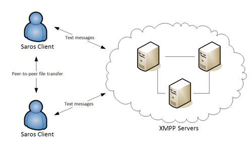
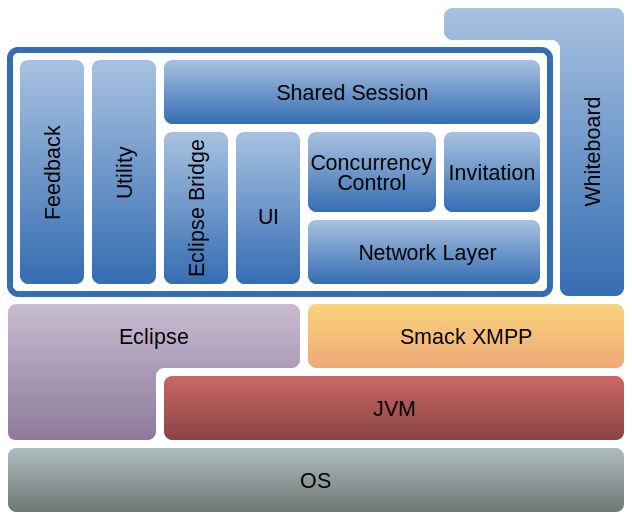
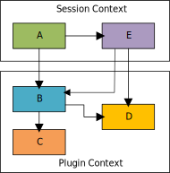
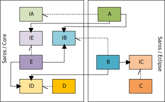
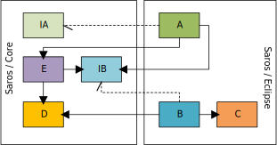
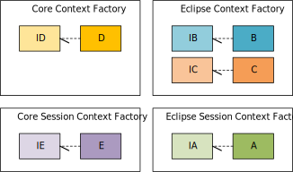
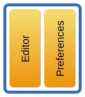

# {{ page.title }}
{:.no_toc}



Basically the following three techniques are used to develop Saros:

* Java as programming language
* XMPP as communication layer
* Eclipse as target development environment to enhance

### Architecture

Since Saros is based on XMPP, it uses a server based architecture.
Communication between clients is done by XMPP messages which are send
over XMPP servers. Exchanging client actions (modifications, selection,
project file operations,...) is done by wrapping activity descriptions
in XMPP messages and sending them to other clients. An exception is the
file transfer. Due to performance reasons it uses a peer to peer
transfer. If this direct connection fails, Saros uses a fallback to file
transfer over XMPP servers.

  

### Software Architecture

Saros uses a layer architecture and consists of eight major modules as
you can see in the image below. The Whiteboard is an additional project
which expands the functionality of the Saros plug-in.

### Internal Dependency Management

We use the [PicoContainer](http://www.picocontainer.org/) library to
manage our component instances using the [Dependency Injection (DI)](https://martinfowler.com/articles/injection.html)
design pattern.

#### During Runtime

We are using two different DI containers (or "contexts"): The Plugin
Context is started when the Saros IDE plugin starts, and exists as long
as the Saros instance is running. A second container is created whenever
a Saros session is started, and it is teared down when the session ends.
Components from the Session Context can access components from the
Plugin Context, but not the other way around.

  

#### At Compile Time

Since Saros comes in different variants (a plug-in for Eclipse, one for
IntelliJ IDEA, and also as a stand-alone server), the components used at
run-time are distributed between the common Core and the specific IDE
plugin code.

The following schema shows a typical situation for the Eclipse plugin
(continuing the example above).

  

The example illustrates the following aspects:

*   IA is an Interface defined in the Core, and it is implemented by
    component A in the IDE plugin. Implementing IA is optional from the
    perspective of the IDE plugin, but it might be helpful (the
    [AbstractContextLifecycle](https://github.com/saros-project/saros/blob/master/de.fu_berlin.inf.dpp.core/src/de/fu_berlin/inf/dpp/context/AbstractContextLifecycle.java)
    is a real-world example from the Saros code).
*   IB is defined in the Core, and needs to be provided with an
    implementation by the IDE plugin as Core-component E needs it.
*   IC is IDE-dependent.
*   ID and IE both define Core components, of which D can be readily
    used, while E needs the IDE plugin to provide an IB implementation.
*   Note: Interfaces ID, IC, and IE could be removed to let components A
    and B depend directly on D, C, and E, respectively (see
    image below). Many components in Saros don't have a separate Java
    interface for this reason.

    

#### Putting together the contexts: Creating the Mapping

The actual mapping from interfaces to concrete components is what is put
into the DI container. In the case of Saros, there are two dimensions
that need to be considered: First, there are two contexts (long-lived
Plugin Context and short-lived Session Context); second, there are
general Core components and specific IDE components. In Saros, we
separate these concerns by *n* times *m* "context factories" (*n=2* for
2 containers, *m=4* for Core, Eclipse, IntelliJ and Server). The above
example would be realized by the following four context factories:

 

There are two "levels" of architecture that are important to distinguish
when dealing with distributed systems: First, there is the system level,
which comprises the entirety of all involved sub-systems. The second
level, in contrast, focuses on the individual sub-systems or nodes.

Applied to Saros, the **system level** is rather easy to understand:

*   During a running session the system is composed of multiple
    Saros-instances that work together in a *Shared Session*. In order
    to communicate with the other participants and to keep the local
    copies of shared files consistent Saros uses XMPP-messages. Saros
    distributes these messages among the participants using a
    *Client-Server-Architecture*. The *Server* is located at the
    *Host's* machine, which means that every participant first sends her
    messages to the Server, and the Server distributes them to all other
    participants (including the client-component of the Host).

The **node level** is more concerned with the infrastructure of a single
Saros instance and this slightly more complicated. To understand the
architecture of Saros, it is helpful to keep in mind that Saros has
**two basic operation modes**:

*   **Changing Session** is rather transitional, because it will only be
    entered to change the configuration of a Session which includes
    setting it up, tearing it down, adding and removing participants as
    well as resources.
*   **Running Session** is the mode Saros will normally run in; it is
    the normal work mode that has no inherent end.

The distinction between the two working modes is also reflected on the
system level, because Saros uses different kinds of XMPP-message for
each:

*   **MESSAGES**:
    For changing a Session, Saros uses *MESSAGES*. The most important
    group of such changes is the *Invitation Process*. Different
    *MESSAGES* will be distinguished by their type (the
    *PackageExtension*).
*   **Activities:**
    During a running Session, Saros needs to capture local actions of
    each user and distribute them to the other participants as events so
    they can react upon them (e.g. performing the same text edit or
    painting an updated viewport annotation because a user
    scrolled down). Saros packages such events as *Activities*.
    Basically everything that doesn't change the Session itself is
    transmitted using Activities.

The two working modes are realized by different components (not
entirely, but partially) which will be described in on the next pages.

### Eclipse Bridge

The Eclipse Bridge contains components that **enable integration of
Saros into Eclipse**.

Contrary to the
[UI](ui.md)which implements
Saros' own user interface the Eclipse Bridge uses **Eclipse' existing
user interface** and tells the API what to do.

The packages `editor `and `preferences `belong to the Eclipse Bridge.

### Editor

The `EditorManger `and the `EditorAPI `are the **most important**
classes in the editor package.

The `EditorManager `**expands the capability** of the existing Eclipse
editors during a Saros session. It listens for user input into an editor
and fires an activity about what the user has changed concerning the
editor (such as an opened editor, the position of the viewport, or
changed text).

The `EditorAPI `**encapsulates the interaction** with the Eclipse
editors (e.g. opens an editor, sets or gets a selection).

The **awareness techniques implemented by annotations** are also
controlled in this module. They include the **user's viewports, text
selections** and **contributions** to the text and make them aware to
all users of that session (marked with the user's color).

### Preferences

In the `preference `package Saros' specific preferences
(`auto_accept_invitation`, `auto_follow_mode`,
`local_socks5_proxy_disabled`) are defined and default values are set
for initialization. These preferences **can be manipulated**. A restore
point is **set to allow restoring the preferences** changed for a
project after the end of a session.
