# {{ page.title }}
{:.no_toc}

## Tips

Adding the following JVM parameter to the Saros/I plug-in's run
configuration enables additional developer tools.
```
-Didea.is.internal=true
```
Those tools can be found under Tools -> internal action.

For example, the UI Inspector is useful when writing GUI tests because
it lets you browse the structure of the GUI components

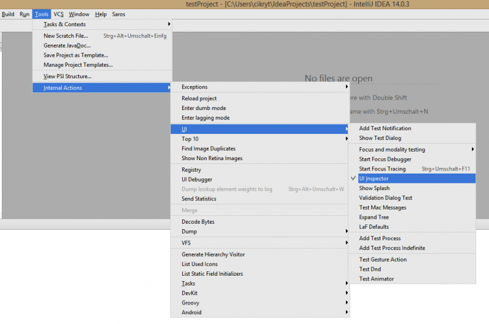

## Test Saros

In order to test Saros for IntelliJ, you have to run two instances of Saros
locally.

The easiest way to test this is to run Saros for Eclipse and Saros for
IntelliJ and connect the two instances. In this case, both a .project
and an .iml file have to be present, otherwise the IDEs can not open the
modules.

However, if you want to test using two IntelliJ instances, some
preparation is necessary. Simply starting the plugin with two run
configurations will not work, it only results in a "Process finished
with exit code 3" error.

### Why does it not work like in Eclipse?

This is because two IDEA instances can not share one home directory (for
plugin development \${idea.home}/system/plugins-sandbox). TO work around
this, you have to create another IDEA SDK with another IDEA home
directory. The problem is that it is not possible to change a module's
IDEA SDK depending on the run configuration, so we have to create a
second **Project** with a different IDEA SDK. The following guideline
will guide you through setting up a second project with another SDK. It
assumes that you have one Saros/I [correctly set
up](https://www.saros-project.org/setup-intellij-environment) in a
folder called saros.

## Create a new project

1.  In IntelliJ, create a new **empty** project "File" &gt; "New
    Project"
    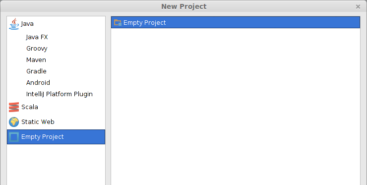
2.  Give it a descriptive name (e.g. "saros-bob"), different from the
    original saros project
3.  In the dialog asking you where to open this project choose "New
    Window"
     

Now you should be inside the project structure dialog of the new
project. If not go there via "File" &gt; "Project Structure"

## Creating a second IDEA SDK

First we have to create a second SDK with a differenct working
directory. Go to the SDKs page.

1.  Click on the big green "+" and select "IntelliJ Platform Plugin
    SDK"

    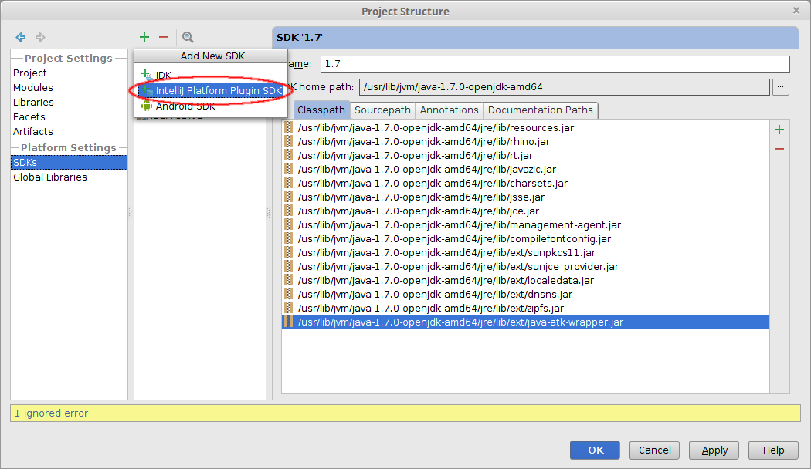 

2.  The default selection for the SDK Home directory is fine.
3.  Rename the new SDK to "IDEA SDK 2".
4.  Change the "Sandbox Home" to "\[...\]/system/plugins-sandbox**2**"

    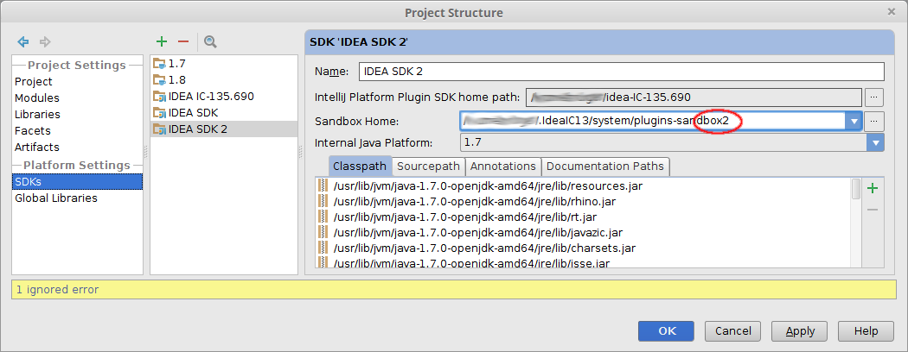

5.  Go the "Project" page and select **IDEA SDK 2** as **Project SDK**

    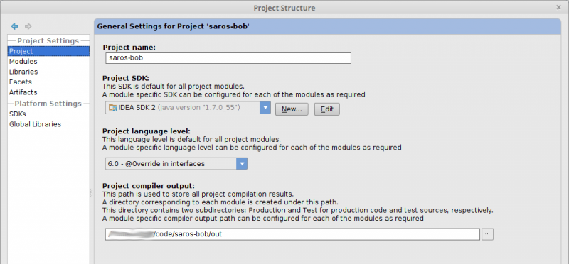

## Import the core module

Now import the core module.

1.  In the new project, go to "Project Settings" &gt; "Modules", click
    the big green "+" and choose **Import Module**.
    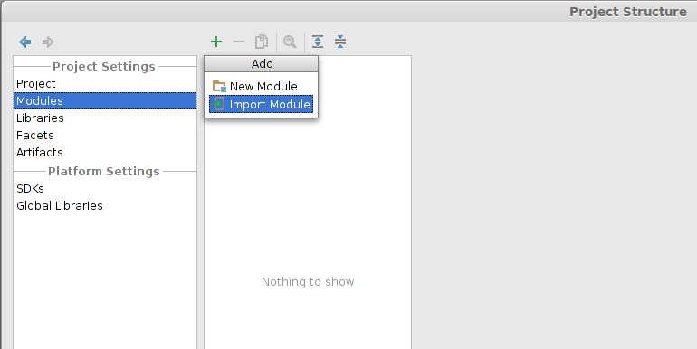
2.  Select
    **de.fu\_berlin.inf.dpp.core\\de.fu\_berlin.inf.dpp.core.iml**.

## Adding libraries

A module details page will pop-up showing many red libraries. We will
now add them:

1.  Then go to the "Libraries" page and click on the big green "+" and
    select "Java".
    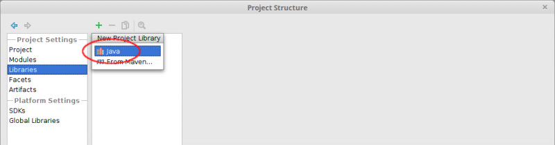
2.  Add the next missing library from
    saros/de.fu\_berlin.inf.dpp.core/lib/ (e.g.
    "commons-codec-1.3.jar")
    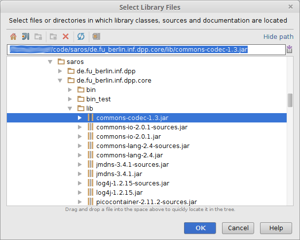
3.  Repeat until all missing dependencies are resolved.
4.  The library **swt-debug.jar** from **de.fu\_berlin.inf.dpp.ui\\lib**
    has to be added, too.
5.  **Attention:** The libraries **smack, smackx, smackx-debug** get a
    wrong default name. If this dialog appears click "Cancel".
    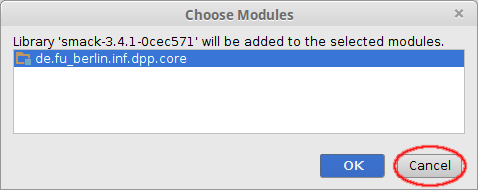
    Do not change the library names in the core module! This would be
    committed to git and lead to merge conflicts.
    Instead, change the library names (in the "Libraries" tab) instead.
    The correct names are as above "smack, smackx, smackx-debug**"**

Now your module page for the core module should look like this:

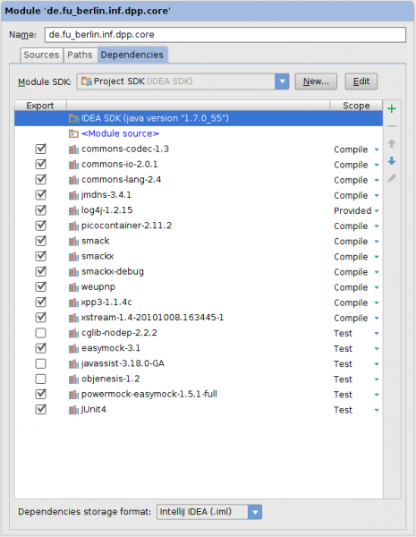

## Add the UI project & UI Frontend

We are planning to unify the UI across both code bases. For this end
there is a UI project and a UI frontend project, that is only used for
development at the moment. In the "Modules" page click on the big green
"+" to add it and select the UI project's .iml file **and** the
ui.frontend project's .iml file:

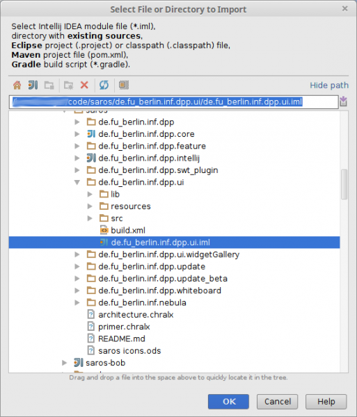

## Add the Saros/I Project

Now you can add the Saros/I:

1.  In the "Modules" page, click on the big green "+" again.
2.  Select the file
    `saros/de.fu_berlin.inf.dpp.intellij/de.fu_berlin.inf.dpp.intellij.iml`
    file from the original saros folder.

Now the projects are properly set up.

As the last step, [create a run
configuration](https://www.saros-project.org/setup-intellij-environment#create-run-configuration).
Now you can execute guest 2 instances of Saros for IntelliJ, from 2 host
instances (you need to have both projects opened in two windows).


## Build and run the Saros IntelliJ IDEA Plugin

On this page, you'll learn more about how to build and run the Saros
IntelliJ IDEA plugin. Head back to the [overview
page](../../documentation/saros-for-intellij.md), if you want to know more about the
process of developing Saros-I and how to get involved in it.

### Deploy and install the Saros-I plugin

Saros/I can be packaged as a .zip file which can be installed in another
IntelliJ instance via "Settings" &gt; "Plugins" &gt; "Install plugin
from disk...". There are two ways of creating the packaged version:

From within IntelliJ IDEA:

-   Go to the folder  "de.fu\_berlin.inf.dpp.ui.frontend/bin/" and
    remove the "META-INF" folder. (This folder will be recreated every
    time you choose the option "Build"&gt;"Rebuild project" and needs to
    be removed every time before the plugin zip can be build.)
-   Inside the project, from the menu, choose "Build" &gt; "Prepare
    Plugin Module 'de.fu\_berlin.inf.dpp.intellij' for Deployment".

Using the command line:

**NOTE:** The current build.xml is set up to work in out server
environment and is not set up in our default IntelliJ environment. We
suggest using the build method provided above until the build file was
adjusted and correctly integrated in a IntelliJ development environment.

-   Inside a terminal, open the IntelliJ project folder
    "de.fu\_berlin.inf.dpp.intellij" and run

        ant plugin.bundle.zip.saros-i

### Working on Saros for IntelliJ with Eclipse (Refactorings)

When refactoring Saros core code it is often useful to be able to
refactor code in the IntelliJ and the Eclipse packages at the same time.
The easiest way to so is to import the IntelliJ project in Eclipse and
configure the appropriate libraries.
(If you find a way to build Saros for Eclipse in IntelliJ, please write
us!)

The guide will assume, that you have Saros for **Eclipse** and for
**IntelliJ** set up and running.

1.  In the "Git repositories" view, unfold "Working directory",
    right-click on "de.fu\_berlin.inf.dpp.intellij" and select "Import
    projects...".
    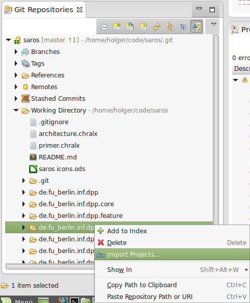

     
2.  From the bullet list, choose "Import existing Projects" and click
    "Finish" on the next page without changing anything.
    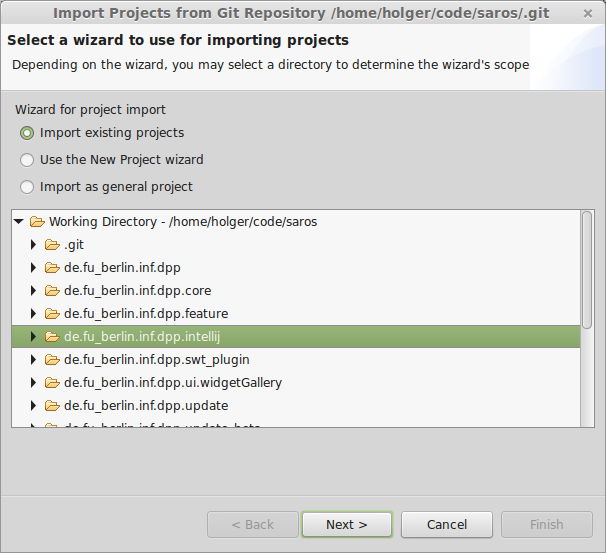
3.  We need to add the IntelliJ libraries to the build path in order to
    compile the project. To do so open "Configure Build Path...", go to
    the "Libraries" tab, click on "Add Variable...".
    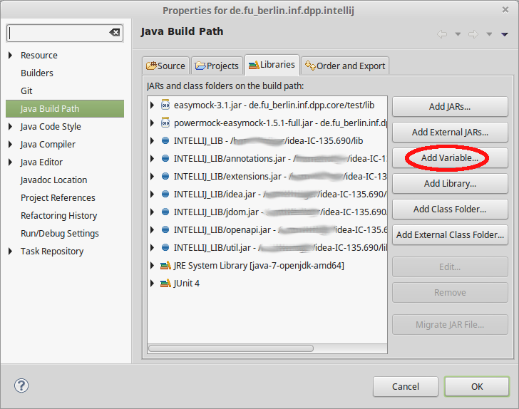
     
4.  In the "New Variable Classpath Entry" dialog, select "Configure
    Variables..."
    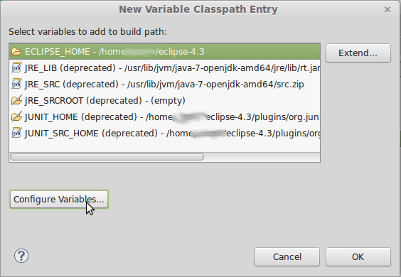
     
5.  In the opening Preferences pages, click on "New..." and create a new
    Classpath Variable called **"INTELLIJ\_LIB"** (exact name) and add
    as **Folder** the "/lib" folder of your local IntelliJ installation
    (found in the IDEA folder).
    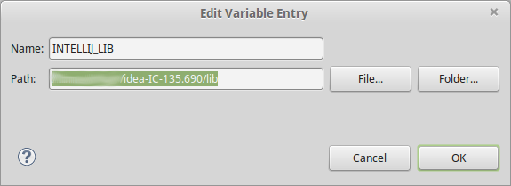

Now your Eclipse is able to compile Saros for IntelliJ!


## Known issues

### Ubuntu 14.04 LTS (64bit) and Linux Mint 17.1 (64bit)

When following the step-by-step setup instructions on this site, the
following error message will be thrown when compiling the Saros-I
project:

```
    (java:30635): GLib-GObject-WARNING **: cannot register existing type 'GdkDisplayManager'
    (java:30635): GLib-CRITICAL **: g_once_init_leave: assertion 'result != 0' failed
    (java:30635): GLib-GObject-CRITICAL **: g_object_new: assertion 'G_TYPE_IS_OBJECT (object_type)' failed
```
To resolve the issue the following steps are necessary:

1.  Install libwebkitgtk-1.0.0, for example via using the APT packet
    manager:` sudo apt-get install libwebkitgtk-1.0.0`
2.  Download SWT binary and sources version 4.3.2
    (<http://download.eclipse.org/eclipse/downloads/drops4/R-4.3.2-201402211700/#SWT>)
3.  Unzip the file and rename "swt.jar"
    to "swt-4.4-gtk-linux-x86\_64.jar". Replace the equally named file
    in
    `path/To/Your/Sandbox/Plugin/Folder/de.fu_berlin.inf.dpp.swt_plugin/resources/`
