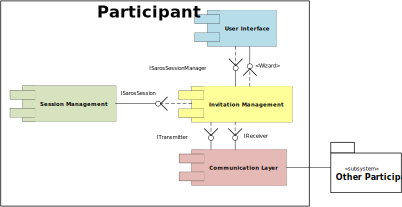
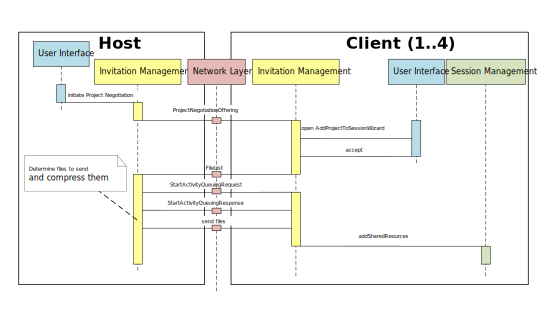
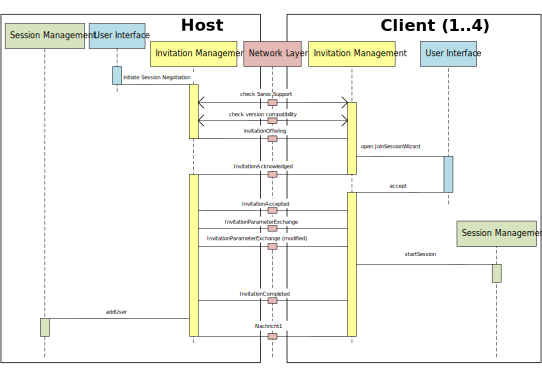
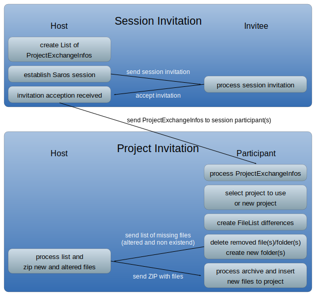

# {{ page.title }}
{:.no_toc}



## Components

This Page shows which components take part in the *Invitation Process*
(Modifing a *Shared Session* itself).

### User Interface

This component is responsible for managing all the visual elements in
Saros, listening to changes in Eclipse and reacting to actions performed
by the local user. In this context, the *User Interface* allows the Host
to add users or projects and displays the needed invitation-dialogs at
both sides.

### Network Layer

This componentis responsible for communicating with other participants
by sending and receiving MESSAGES. The main entrance-points of this
component are the Interfaces *ITransmitter* for sending messages and the
*IReceiver* for receiving them.

### Invitation Management

The *Invitation Management* is responsible for starting a *Shared
Session* or adding new users or projects to a running session. The
*Invitation Process* itself is divided into the two subcomponents
*Session Negotiation* and *Project Negotiation*. Both are started by the
*Invitation Management* and are only active while the respective
*Invitation Process* is running.

-   [**Session Negotiation**](../sessionNegotiation.md)**:** The
    *Session Negotiation* is responsible for adding a new user to
    the session.
-   [**Project Negotiation:**](../projectNegotiation.md) The *Project
    Negotiation* is responsible for sharing projects with the
    participants and adding new projects to a running session.

A *Negotiation* is always performed between the Host and a Client to
ensure consistency in a running session. Saros supports the invitation
of multiple users at once. In this case multiple *Negotiation*
*Processes* are started concurrently, one for each invitee.

### Session Management

The *Session Management* is responsible for keeping a running session
consistent. For more informations see [Session
Management](../componentsRunningSession.md). After the *Invitation
Management* has established or changed a session the *Session
Management* is informed about the changes so that new users and projects
will be minded by Saros going forward.

During an Invitation a running session goes on, so that other
participants aren't forced to wait until a new user joined for Example.
This leads to a couple of rules for joining users that have to be met.
See [User States](../userStates.md) for more informations.

## Project Negotiation
The following diagram shows how the *Project Negotiation* works and what
MESSAGES get sent between the Host and the invitee.

The *Project Negotiation* starts with the Host sending a
*ProjectNegotiationOffering* to the Client. This Message contains
informations that the Client needs, for example which projects will be
shared and the ID of the session.

The *Invitation Management* of the Client then informs the *User
Interface* which opens a wizard, informing the Client about the *Project
Negotiation* and asking him to chose a location for the projects that
will be transmitted.

After the Client accepted the *Project Negotiation* he compares the List
of files he got by th*e ProjectNegotiationOffering* with his local files
and sends a *FileList* containing all the files he is missing. The
Host than sends a *StartActivityQueuingRequest* to signal the Client
that he should start queuing incoming Activities. After starting queuing
the Client acknowledges the queuing request.

The Host then determines which projects he has to send and compresses
them into a zip-archive. While the projects get compressed the session
is blocked for all users, to ensure that no file gets modified while
being compressed. Afterwards the Host sends the archive containing all
missing files back to the Client and the Client unpacks them. After the
files have been added to the Clients workspace he informs his *Session
Management* about the new files to be managed.

### Project Invitation

Within the *Project Invitation* all shared projects/files will be synchronized
so that all participants (including host) have the same project data.

**After the session is established** another wizard will open at the
participant's side.

For each project of the session the participant can choose to **use an
existing project** out of her/his workspace or to **create a new
project**.

Based on the `ProjectExchangeInfo` the **differences to the host
project** will be detected.

Files or folders that **don't exist** in the host project **will be
deleted** on the participant's side.

**Missing or different files** on the participant's side **will be
added/updated**.

For all data transfer between the host and the participant the
`XMPPTransmitter` of the [Network Layer](networklayer.md) will be
used.

Once the session is created **every participant** of this session is
able to **add new projects or files** to this session.

## Session Negotiation

The following diagram shows how the *Session Negotiation* works and
which *MESSAGES* are sent between the Host and the invitee.

The *Session Negotiation* is started, when the Host invites a user to a
session. The *User Interface* registers this action and starts the
*Negotiation Process*. The *Invitation Management* of the Host first
asks the Client if he has a Saros-instance running and if his version is
compatible with the version of the Host. Afterwards he sends an
*invitationOffering* to the Client.

All *MESSAGES* are send and received by the *Network Layer* which
communicates with the *Invitation Management*. The *Invitation
Management* informs the *User Interface* which then opens a wizard,
informing the Client about the invitation. At the same time an
acknowledgment is sent back to the Host informing him, that the Client
has received the invitation.

Once the Client accepted the invitation he first sends an
*invitationAccepted* and afterwards tells the host which session
parameters he would prefer. These parameters includes for example the
desired color.

The Host evaluates this preferences and sends the actual session
parameters back to the Client. With these session parameters the Client
then creates a new session and sends the Host a final acknowledgment, to
which the Host informs his *Session Management* that a new user has
joined the session.

### Session Invitation
During the *Session Invitation* a Saros session will be established between the host and the inviteee.

The list of `ProjectExchangeInfos` will be generated based on the
resources **selected by the host**.

They contain **information regarding the project** (`projectID`,
`projectName`, and description of the project) and a `FileList` which
holds information about the files and folders belonging to the project
(path and checksum).

When the host sends a session invitation **a wizard will open** on the
invitee's side.

This **wizard invites the invitee** to this Saros session and shows the
projects which **need to be synchronized**.

