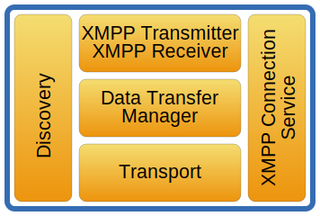

# {{ page.title }}
{:.no_toc}



The important concepts of the Network Layer are shown in the image
below.

## Overview of the network layer

 
### Discovery

The
[net.discovery](https://github.com/saros-project/saros/tree/master/de.fu_berlin.inf.dpp.core/src/de/fu_berlin/inf/dpp/net/discovery)
component consists of the
[DiscoveryManager](https://github.com/saros-project/saros/blob/master/de.fu_berlin.inf.dpp.core/src/de/fu_berlin/inf/dpp/net/discovery/DiscoveryManager.java)
and the
[DiscoveryManagerListener](https://github.com/saros-project/saros/blob/master/de.fu_berlin.inf.dpp.core/src/de/fu_berlin/inf/dpp/net/discovery/DiscoveryManagerListener.java).
It will request and keep track of the features supported by the contacts
(e.g. whether Saros is supported or it is just a normal XMPP account)
and stores the presence information for each user.

### Transport

The classes
[Socks5Transport](https://github.com/saros-project/saros/blob/master/de.fu_berlin.inf.dpp.core/src/de/fu_berlin/inf/dpp/net/internal/Socks5Transport.java),
[IBBTransport](https://github.com/saros-project/saros/blob/master/de.fu_berlin.inf.dpp.core/src/de/fu_berlin/inf/dpp/net/internal/IBBTransport.java)
and the
[BinaryChannelConnection](https://github.com/saros-project/saros/blob/master/de.fu_berlin.inf.dpp.core/src/de/fu_berlin/inf/dpp/net/internal/BinaryChannelConnection.java)
belong to the Transport concept. Socks5Transport and IBBTransport both
extend the abstract class
[ByteStreamTransport](https://github.com/saros-project/saros/blob/master/de.fu_berlin.inf.dpp.core/src/de/fu_berlin/inf/dpp/net/internal/ByteStreamTransport.java)
and use BytestreamManager from Smack to establish a bytestream
connection to exchange data. There are two types of bytestream
connections that can be established:
[Socks5](http://xmpp.org/extensions/xep-0065.md) and
[IBB](http://xmpp.org/extensions/xep-0047.md).

[Socks5](http://xmpp.org/extensions/xep-0065.md) can be either direct
(peer-to-peer) or mediated (through a proxy server).
[TCP](http://en.wikipedia.org/wiki/Transmission_Control_Protocol) is the
typically used transport protocol. The host sends a connection request
to the participant and the participant tries to establish that
connection. To back up the connection establishment in Saros, the
participant also sends an connection request and the host tries to
establish that connection. If the first connection is established and it
is bidirectional then this one will be kept and the second will be
discarded. If both connections are established but they are
uni-directional then both connection will be kept and wrapped into one
bidirectional one.

If no [Socks5](http://xmpp.org/extensions/xep-0065.md) connection can
be established, a slower In Band Bytestream
([IBB](http://xmpp.org/extensions/xep-0047.md)) connection will be
established and used. [IBB](http://xmpp.org/extensions/xep-0047.md) is
an XMPP protocol extension that establishes a one-by-one bytestream
between any two peers. The data is divided into smaller chunks and
transported over XMPP.

BinaryChannelConnection is a class that encapsulates a bidirectional
communication between two participants. The BinaryChannelConnection is
working on a BytestreamSession which is either a Socks5Transport or a
IBBTransport.

 

### Data Transfer Manager

The
[DataTransferManager](https://github.com/saros-project/saros/blob/master/de.fu_berlin.inf.dpp.core/src/de/fu_berlin/inf/dpp/net/internal/DataTransferManager.java)
is the major class for sending arbitrary data. It is responsible for
handling all transfers of binary data via ByteStreamTransport. If
possible it reuses an established bytestream connection.

 

### XMPP Transmitter / XMPP Receiver

The
[XMPPTransmitter](https://github.com/saros-project/saros/blob/master/de.fu_berlin.inf.dpp.core/src/de/fu_berlin/inf/dpp/net/internal/XMPPTransmitter.java)
and
[XMPPReceiver](https://github.com/saros-project/saros/blob/master/de.fu_berlin.inf.dpp.core/src/de/fu_berlin/inf/dpp/net/internal/XMPPReceiver.java)
are important classes when sending, receiving, and processing data
through XMPP.

The XMPPReceiver is a Facade for receiving XMPP packages. It receives
and passes on packets and
[IncomingTransferObjects](https://github.com/saros-project/saros/blob/master/de.fu_berlin.inf.dpp.core/src/de/fu_berlin/inf/dpp/net/IncomingTransferObject.java)
to registered listeners with accepting filters.

The XMPPTransmitter is the central class for sending object (e.g.
activities, file lists) to peers by XMPP and receiving objects by
registering a listener on the XMPPReceiver. A
[TransferDescription](https://github.com/saros-project/saros/blob/master/de.fu_berlin.inf.dpp.core/src/de/fu_berlin/inf/dpp/net/internal/TransferDescription.java)
contains all necessary information for dealing with FileTransfers to a
contact via Jingle, IBB, or Chat.

### XMPP Connection Service

The
[XMPPConnectionService](https://github.com/saros-project/saros/blob/master/de.fu_berlin.inf.dpp.core/src/de/fu_berlin/inf/dpp/net/xmpp/XMPPConnectionService.java)
encapsulates XMPP connection related objects and functions.

## Data connections in Saros

Saros uses XMPP for messaging and presence retrieval, sharing
information by sending messages between participants. In addition to
this method, Saros also uses the bytestream extensions
([XEP-0065:](http://xmpp.org/extensions/xep-0065.md) SOCKS5
Bytestreams
and [XEP-0047:](http://xmpp.org/extensions/xep-0047.md) In-Band
Bytestreams) for sending other arbitrary data, such as when sharing
project files.

A Socks5 Bytestream (S5B) is established as a direct connection between
two peers (direct Socks5 Bytestream) or with a proxy as mediator
(mediated Socks5 Bytestream).

An In-Band Bytestream (IBB) is just a virtual connection. All the data
is actually broken down into many chunks which are sent in messages over
the XMPP network. Compared to a S5B, data exchange over IBB can be very
slow because of the higher overhead and throughput limitations of XMPP
servers (some servers only allow 1 KiB/s or 4 KiB/s).

Since an S5B is recommended for fast data exchange, Saros first attempts
to create a S5B. If this fails, it then attempts to create an IBB.

