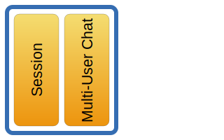
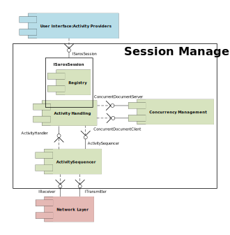

# {{ page.title }}
{:.no_toc}



  A session is a virtual meeting that takes place between two or more
people using Saros. It is started and ended at will by the host; others
can join upon invitation and leave at will. Within a session, users can
do a number of things:

-   Share a project (this is currently the required way to initiate a
    session, but in theory Saros can easily be adapted in future to
    begin "empty" sessions)
-   Chat using an instant messenger

The functionality for the session is distributed throughout the packages
project and communication (muc for multi-user chat).

## Session

The core functionality for maintaining both the session and the shared
project(s) are kept in the project package. (TODO: this ought to be
refactored to separate the former synonymy in projects and shared
sessions.)

A session takes care about the user's state within a session (e.g.
write/read-only access or adds/removes a user). The SarosSessionManager
handles the initiation of a Saros session (including starting, stopping
and joining) and the invitation to this session.

The shared project stores the state of a project shared in a Saros
session (e.g. project open) and its resources (e.g. files, folders,
projects, and the version control system if the VCS support is enabled
for the session). For identifying shared projects across the network,
project IDs are used in the SarosProjectMapper class. This is necessary
especially when the local names of a shared project are different at the
user's workspaces.

The SharedResourcesManager is responsible for handling all resource
changes that aren't handled by the EditorManager of the [Eclipse
Bridge](../eclipsebridge.md). It creates and executes files, folders,
and VCS activities.

You will find information about activities [here](../activities.md).

## Multi-User Chat

The functionality of the Multi-User Chat is located in the
communication.muc package.

In a multi-user text chat the users can exchange text messages in a
chatroom. Therefore the XMPP protocol extension Multi-User Chat
([MUC](http://xmpp.org/extensions/xep-0045.md)) is used. When a Saros
session is started a Multi-User Chat is initiated as well. As long as
the chat is active the history of all events that occur to this chat
session (e.g. incoming messages) are stored and transmitted to all users
joining this chat.

The MUCManager manages the creation and destruction of a Multi-User Chat
session. The host creates/destroys a MUCSession while other users
join/leave that MUCSession based on the preferences (roomName, password,
and service, the host name at which the multi-user chat is running).

## VoIP

The communication package also contains the SkypeManager which allows
the user to initiate a Skype VoIP session to a given XMPP entity if it
supports Skype.

## Session Management

The *Session Management* is composed of a number of sub-components as
can be seen in the following figure. For more information on the actual
Activity sending see [Activity Sending](../activitySending.md).

-   **Activity Providers/Registry**

    The Session Management internally has a *Registry* that manages
    registered *Activity Providers*.
    *Activity Providers* are a special part of the *User Interface*.
    They are the responsible for transforming actions of the local user
    into Activities that can then be sent to remote users. They are also
    responsible for executing remote Activities at the
    local Saros-instance. Every *Activity Provider* is responsible for a
    certain type of Activities. Whenever a registered *Activity
    Provider* creates a new Activity the *Registry* gets informed about
    this and passes it to the *Activity Handling*.
    The *Registry* also informs all registered *Activity Providers*
    whenever an incoming Activity has to be executed locally. Every
    *Activity Provider* is himself responsible for knowing which
    Activities he has to execute and which he has to ignore.
    The *Registry* is essentially a List in the
    [*ISarosSession*](http://saros-build.imp.fu-berlin.de/sarosDoc/interfacede_1_1fu__berlin_1_1inf_1_1dpp_1_1project_1_1_i_saros_session.md).
    *Activity Providers* have to register at the *ISarosSession* which
    then functions as the *Registry*.

-   **Activity Handling**

    This is the main component of the *Session Management*. It basically
    functions as a coordinator between the other components. It gets new
    Activities from the *Registry*, calls the *Concurrency Management*
    if needed, determines receivers for this Activity, and sends the
    result to the *Activity Sequencer* or the other way around for
    incoming Activities.
    The main entrance points of the *Activity Handling* are the
    *ISarosSession* for local Activities and the
    [*ActivityHandler*](http://saros-build.imp.fu-berlin.de/sarosDoc/classde_1_1fu__berlin_1_1inf_1_1dpp_1_1project_1_1internal_1_1_activity_handler.md)
    for incoming Activities.

-   **Concurrency Management**

    The *Concurrency Management* is responsible for keeping concurrent
    documents consistent. Saros uses the *Jupiter* architecture (often
    misleadingly called Jupiter algorithm) to accomplish this. This
    includes the transformation ("operational transformation", OT) of
    some Activities, most importantly the *TextEditActivities* that
    represent modifications of shared documents.
    The main entrance points of this component are the
    [*ConcurrentDocumentServer*](http://saros-build.imp.fu-berlin.de/sarosDoc/classde_1_1fu__berlin_1_1inf_1_1dpp_1_1concurrent_1_1management_1_1_concurrent_document_server.md)
    for the Server and the
    [*ConcurrentDocumentClient*](http://saros-build.imp.fu-berlin.de/sarosDoc/classde_1_1fu__berlin_1_1inf_1_1dpp_1_1concurrent_1_1management_1_1_concurrent_document_client.md)
    for the Clients.

-   **Activity Sequencer**

    The *Activity Sequencer* is responsible for ordering outgoing and
    incoming Activities to ensure that no Activities are lost. The
    *Activity Sequencer* is registered as a *PacketListener* at the
    *Network Layer* and informs the *Activity Handling* about incoming
    Activities as well as forwarding outgoing Activities to the *Network
    Layer*.
    The main entrance point of this component is the
    [ActivitySequencer](http://saros-build.imp.fu-berlin.de/sarosDoc/classde_1_1fu__berlin_1_1inf_1_1dpp_1_1project_1_1internal_1_1_activity_sequencer.md).
