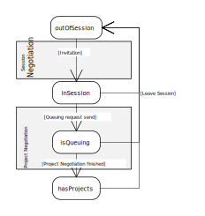

# {{ page.title }}
{:.no_toc}



## Invitation Process

During the *Invitation Process* every user traverses a few states before
he is a full member of the session. The following diagram shows these
transitions.

Users that are currently not in a session are in the initial state
**outOfSession**. In this state they don't receive Activities from other
users. The state changes when the user gets invited to a session. This
is done by the *Session Negotiation*.

Once the user finished the *Session Negotiation* he enters the state
**inSession**. This state signals that the user is part of the running
session but doesn't have the shared projects yet. While in this state
the user can see all other participants and can be seen by them. He is
also able to chat with other participants. He can accept some Activities
but can't process *IResourceActivities* as he doesn't have the projects
yet. The user leaves this state during a certain point in the following
*Project Negotiation*.

Once the Host has sent the *startQueuing*-*MESSAGE* the new user starts
to queue any *IResourceActivity*. The user is now in the state
**isQueuing**. As soon as the user entered this state he receives
*IResourceActivities* from all participants but instead of executing
them he just puts them into a queue.
 
The queued Activities are executed as soon as the Host has sent all
missing projects and the new user finished the *Project Negotiation*.

From that moment on the new user is a full member of the session and has
reached the final state **hasProjects**.

A user can return from every state to the initial state **outOfSession**
by leaving the session or canceling the *Session* or *Project
Negotiation*.
